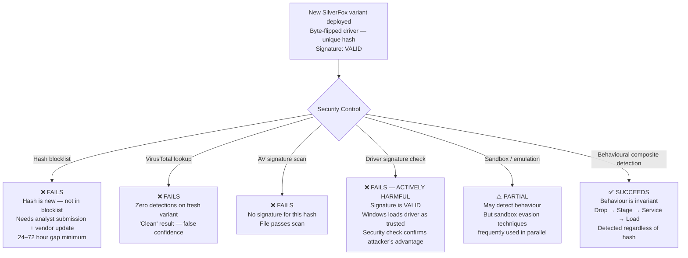
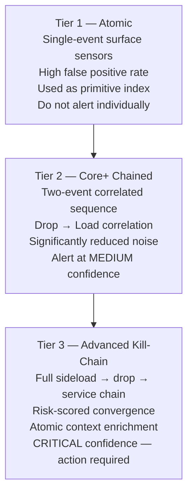
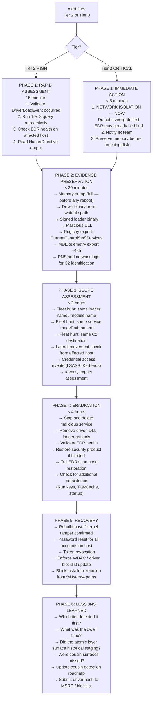

# SilverFox / ValleyRAT — BYOVD vs Polymorphic Malware
### *Why Signatures Fail and Behaviour Wins*

**Author:** Ala Dabat | [github.com/azdabat](https://github.com/azdabat)  
**Version:** 2025-12  
**Repository:** [Novel-Tradecraft-Research-Emerging-Attack-Ecosystems](https://github.com/azdabat/Novel-Tradecraft-Research-Emerging-Attack-Ecosystems)  
**License:** [CC BY-NC-SA 4.0](https://creativecommons.org/licenses/by-nc-sa/4.0/legalcode)  
**Framework:** [Minimum Truth Detection Framework](https://github.com/azdabat/Minimum-Truth-Detection-Framework-ADX-Validated-Composite-Rules)

---

> *"SilverFox does not exploit a zero-day.*  
> *It exploits the trust Windows places in signed binaries.*  
> *The signature is the weapon."*

---

## Table of Contents

- [Overview — The Threat](#overview--the-threat)
- [Byte-Flipping vs Polymorphism — The Core Technical Distinction](#byte-flipping-vs-polymorphism--the-core-technical-distinction)
- [Why Every Signature-Based Control Fails](#why-every-signature-based-control-fails)
- [The Attack — Full Kill Chain (Offensive Perspective)](#the-attack--full-kill-chain-offensive-perspective)
- [Stage-by-Stage Technical Breakdown](#stage-by-stage-technical-breakdown)
- [Behavioural IOC Catalogue](#behavioural-ioc-catalogue)
- [MITRE ATT&CK Mapping](#mitre-attck-mapping)
- [Detection Architecture — Three Tiers](#detection-architecture--three-tiers)
- [Validation & Testing Matrix](#validation--testing-matrix)
- [Incident Response Lifecycle](#incident-response-lifecycle)
- [Why Behavioural Composite Detection Is the Only Viable Defence](#why-behavioural-composite-detection-is-the-only-viable-defence)

---

## Overview — The Threat

SilverFox (also tracked as *ValleyRAT* and *SilverCat*) is a Chinese-nexus espionage-focused
threat cluster active across 2024–2025, targeting financial services, technology, logistics,
and supply chain organisations across Asia-Pacific with expanding global reach.

Unlike ransomware operators who prioritise speed and visibility, SilverFox invests in
**patient, multi-stage tradecraft** built around a single operational principle: exploit the
trust that Windows places in digitally signed binaries rather than exploiting a vulnerability.

The result is an attack chain that defeats:

- Hash-based IOC blocklists
- VirusTotal lookups and signature scanning
- File-based AV and endpoint protection
- Static analysis and sandboxing
- Any control that asks "is this file known bad?"

The only viable detection surface is **adversary behaviour** — the sequence of actions the
attacker must perform regardless of which specific file they use.

---

## Byte-Flipping vs Polymorphism — The Core Technical Distinction

This is the central technical insight of this document. Understanding why byte-flipping is
more dangerous than classical polymorphism explains why the entire signature-based detection
industry is structurally inadequate against this threat family.

### Classical Polymorphic Malware

Polymorphic malware mutates its code structure across instances — changing encryption keys,
reordering instructions, inserting junk code — to produce binaries with different hashes
while preserving malicious functionality.

**The problem polymorphism creates for detection:** The AV vendor cannot maintain blocklists
for an infinite number of file variants. Signatures become stale immediately.

**The problem polymorphism creates for the attacker:** The mutation process modifies the
binary's code. If the binary was originally signed, the signature is cryptographically tied
to the file contents. Any modification **invalidates the signature**. The OS treats the
mutated binary as unsigned. Windows kernel driver loading **requires a valid signature**.
Polymorphism cannot be applied to drivers without breaking driver loading.

### SilverFox Byte-Flipping

SilverFox solves this problem with surgical precision. Instead of mutating code, it modifies
a single byte in a **non-authenticated region** of the PE (Portable Executable) header —
typically the `TimeDateStamp` field, compilation timestamp, or padding bytes that are
**explicitly excluded from the cryptographic signature calculation**.

```mermaid
graph LR
    subgraph Signed["Legitimate Signed Driver (Original)"]
        A1["PE Header\nTimeDateStamp: 0x5F3A2B1C"]
        A2["Signed Code Section\nCryptographically authenticated"]
        A3["Digital Signature\nValid — covers code section only"]
    end

    subgraph Flipped["Byte-Flipped Driver (SilverFox Variant)"]
        B1["PE Header\nTimeDateStamp: 0x5F3A2B1D ← 1 byte changed"]
        B2["Signed Code Section\nIdentical — unchanged"]
        B3["Digital Signature\nStill VALID — timestamp not in scope"]
    end

    subgraph Result["Detection Result"]
        R1["Hash: DIFFERENT\nEvery blocklist misses it"]
        R2["Signature: VALID\nWindows loads it as trusted kernel driver"]
        R3["Behaviour: IDENTICAL\nSame exploitation capability"]
    end

    Signed -->|"Single byte mutation\nin non-authenticated region"| Flipped
    Flipped --> Result
```



### Side-by-Side Comparison

| Property | Classical Polymorphic | SilverFox Byte-Flipping |
|----------|----------------------|------------------------|
| **Goal** | Evade AV signature matching | Evade hash blocklists while keeping signature valid |
| **Mutation scope** | Entire code structure | Single byte in non-authenticated PE header field |
| **File hash** | Changes on every variant | Changes on every variant |
| **Digital signature** | **Invalidated** by mutation | **Remains valid** — mutation outside signature scope |
| **OS trust level** | Untrusted (no signature) | Trusted (valid Microsoft partner signature) |
| **Kernel loading** | **Blocked** — requires valid signature | **Permitted** — OS verifies signature as valid |
| **VT / blocklist** | Misses unknown variants | Misses every variant by design |
| **Hash-based IOC** | Fails (too many variants) | Fails (infinite valid-signature variants) |
| **Required defence** | Heuristic / behaviour analysis | **Behavioural detection only** |

### The Implication

Classical polymorphism produces unsigned, untrusted variants that Windows blocks at the
kernel driver loading stage. Byte-flipping produces **signed, trusted variants** that
Windows actively loads as legitimate kernel drivers. Every security control that answers
the question *"is this file known bad?"* fails completely. The only viable question is:
*"is this behaviour consistent with attacker tradecraft?"*

---

## Why Every Signature-Based Control Fails



---

## The Attack — Full Kill Chain (Offensive Perspective)

```mermaid
graph TD
    A["Stage 0\nInitial Delivery\nSEO poisoning / malvertising\nFake installer (WeChat, Zoom, Teams)\nT1189 / T1204.002"] --> B

    B["Stage 1\nSigned Binary Execution\nLegitimate signed binary executed\nfrom user-writable path\nT1218 — Signed Binary Proxy"] --> C

    C["Stage 2\nDLL Sideloading\nMalicious DLL loaded from same directory\nExecution inside trusted process context\nT1574.002"] --> D

    D["Stage 3\nValleyRAT Loader Active\nUser-mode implant running\nInvisible to AV — inside signed process\nBegins BYOVD preparation"] --> E

    E["Stage 4\nDriver Staging\nVulnerable signed driver dropped to Temp\nByte-flip mutation applied\nNew hash — signature still valid\nT1027"] --> F

    F["Stage 5\nKernel Service Registration\nsc.exe / Registry API / PowerShell\nService created pointing to .sys\nT1543.003"] --> G

    G["Stage 6\nBYOVD Exploitation\nKernel driver loaded via service start\nVulnerability exploited for ring-0 access\nT1068"] --> H

    H["Stage 7\nEDR Blinding\nfltmc unload security minifilter\nWinDefend / Sense terminated\nEndpoint now blind\nT1562.001"] --> I

    I["Stage 8\nValleyRAT Payload\nRAT injected into legitimate process\nC2 established — low-volume HTTPS\nCredential / data exfiltration\nT1055 / T1071"]

    style A fill:#555,color:#fff
    style B fill:#8B4513,color:#fff
    style C fill:#8B4513,color:#fff
    style D fill:#1F4E79,color:#fff
    style E fill:#1F4E79,color:#fff
    style F fill:#1F4E79,color:#fff
    style G fill:#8B0000,color:#fff
    style H fill:#8B0000,color:#fff
    style I fill:#4B0082,color:#fff
```



---

## Stage-by-Stage Technical Breakdown

### Stage 0 — Initial Delivery

SilverFox reaches targets through SEO-poisoned search results and malvertising that serve
fake software installers disguised as legitimate applications. Observed lures include:

- WeChat installer (`WeChat_Setup.exe`)
- Zoom update (`Zoom_v5.16.x.exe`)
- Teams installer (`Teams_windows_x64.exe`)
- VPN clients and financial platform installers

The installer is a legitimate signed binary bundled alongside the malicious components.
When executed, the legitimate application installs normally while the loader is silently
staged to `%APPDATA%` or `%TEMP%`.

### Stage 2 — DLL Sideloading Mechanics

The sideloading technique exploits the Windows DLL search order. When a binary executes,
Windows searches for required DLLs in this order:

```
1. The directory containing the executable  ← Attacker-controlled
2. The system directory (System32)
3. The Windows directory
4. The current directory
5. Directories in the PATH variable
```

SilverFox places the signed loader and the malicious DLL in the same directory:

```
%APPDATA%\MicrosoftEdgeUpdate\
  ├── MicrosoftEdgeUpdate.exe   (SIGNED — legitimate Microsoft binary)
  └── version.dll               (MALICIOUS — loaded from same directory)
```

Windows resolves `version.dll` from the local directory before System32. The malicious DLL
loads into the trusted process context. No child process is spawned. No command-line argument
is visible. The malicious code runs invisibly inside a signed, trusted binary.

### Stage 4 — Byte-Flipping in Practice

```
Original vulnerable driver:
  File: amsdk.sys
  Hash: A1B2C3D4E5F6...
  TimeDateStamp: 0x5F3A2B1C
  Signature: VALID (hardware vendor signed)

After byte-flip:
  File: amsdk.sys (same name, different content)
  Hash: F6E5D4C3B2A1...  ← completely different
  TimeDateStamp: 0x5F3A2B1D  ← one byte changed
  Signature: VALID  ← unchanged, timestamp not in scope
```

The attacker generates a unique hash for every campaign deployment. No two victims receive
the same file hash. Every blocklist fails. The OS kernel validates the signature as legitimate.

### Stage 6 — BYOVD Exploitation

Once the kernel driver loads, the vulnerability within it — typically an authenticated or
unauthenticated kernel read/write primitive — grants ring-0 code execution. The malware:

1. Enumerates the kernel's process list structures directly in memory
2. Locates the EDR's kernel process object
3. Terminates the process from kernel space (cannot be protected by user-mode security)
4. Removes the EDR's kernel callback registrations
5. The security product is now permanently blind — restarting it will not work while the
   driver is loaded

---

## Behavioural IOC Catalogue

These indicators are **hash-invariant** — they remain valid across every byte-flipped variant
because they describe what the attacker must do, not what file they use.

### Process Lineage Anomalies

| Parent Process | Child / Behaviour | Why Suspicious |
|---------------|------------------|----------------|
| Fake installer (signed, writable path) | Spawns legitimate-looking binary | Trojanised installer pattern |
| Signed binary from `%APPDATA%` | Loads DLL from same directory | Classic sideloading precursor |
| Any user-mode process | Drops `.sys` to `%TEMP%` / `%APPDATA%` | Kernel drivers never stage here legitimately |
| Any user-mode process | `sc.exe create ... binPath=...Temp\*.sys` | Kernel service from writable path — near-certain BYOVD |
| Any process | `fltmc.exe unload <EDR-filter>` | Active EDR blinding in progress |

### File Staging Indicators

| Indicator | Confidence | Notes |
|-----------|------------|-------|
| `.sys` file created in `%TEMP%`, `%APPDATA%`, `%ProgramData%`, `%Public%` | CRITICAL | Legitimate drivers install to `System32\drivers` only |
| `.sys` file with valid signature but non-standard path | CRITICAL | Byte-flipped BYOVD driver profile |
| `.dat` or `.bin` file with PE magic bytes in writable path | HIGH | Disguised driver staging |
| Signed binary in `%APPDATA%` loading DLL from same directory | HIGH | Sideloading precursor |

### Network Indicators

| Behaviour | Profile | Notes |
|-----------|---------|-------|
| Low-volume HTTPS POST every 30–90 seconds | RAT beacon | ValleyRAT C2 profile |
| Outbound connection from sideloaded binary process | Unusual source | C2 callback from trusted process |
| C2 destinations: China-nexus, rapidly rotating CDN infrastructure | Attribution | Matches ValleyRAT campaign pattern |

---

## MITRE ATT&CK Mapping

```
┌────────────────────────┬──────────────────────────────────────┬──────────────┬────────┐
│  TACTIC                │  TECHNIQUE                           │  ID          │  STAGE │
├────────────────────────┼──────────────────────────────────────┼──────────────┼────────┤
│  Initial Access        │  Drive-By Compromise                 │  T1189       │  0     │
│                        │  User Execution: Malicious File      │  T1204.002   │  0     │
├────────────────────────┼──────────────────────────────────────┼──────────────┼────────┤
│  Defense Evasion       │  DLL Side-Loading                    │  T1574.002   │  2     │
│                        │  Signed Binary Proxy Execution       │  T1218       │  1     │
│                        │  Obfuscated Files / Artifacts        │  T1027       │  4     │
│                        │  Masquerading                        │  T1036       │  0–2   │
│                        │  Impair Defenses: Disable Tools      │  T1562.001   │  7     │
├────────────────────────┼──────────────────────────────────────┼──────────────┼────────┤
│  Privilege Escalation  │  Exploitation for Priv Esc           │  T1068       │  6     │
│                        │  Create/Modify Windows Service       │  T1543.003   │  5     │
├────────────────────────┼──────────────────────────────────────┼──────────────┼────────┤
│  Persistence           │  Create/Modify Windows Service       │  T1543.003   │  5     │
├────────────────────────┼──────────────────────────────────────┼──────────────┼────────┤
│  Execution             │  Windows Service                     │  T1569.002   │  5–6   │
├────────────────────────┼──────────────────────────────────────┼──────────────┼────────┤
│  Collection            │  Input Capture / Screen Capture      │  T1056       │  8     │
├────────────────────────┼──────────────────────────────────────┼──────────────┼────────┤
│  Command & Control     │  Application Layer Protocol: Web     │  T1071.001   │  8     │
│                        │  Encrypted Channel                   │  T1573       │  8     │
├────────────────────────┼──────────────────────────────────────┼──────────────┼────────┤
│  Exfiltration          │  Exfiltration Over C2 Channel        │  T1041       │  8     │
└────────────────────────┴──────────────────────────────────────┴──────────────┴────────┘
```

---

## Detection Architecture — Three Tiers

The Minimum Truth Detection Framework mandates a three-tier detection architecture for
complex kill chains. Each tier builds on the previous, increasing fidelity and reducing
false positives.



### Tier 1 — Atomic Surface Sensor

Minimum truth: a kernel driver service was created pointing to a user-writable path.
High noise. Used as a primitive in the atomic index — not as a standalone alert.

```kql
// TIER 1: Atomic Surface Sensor
// Minimum Truth: sc.exe creates kernel service pointing to writable path
// Purpose: Feed atomic primitive index — do not alert on this alone

DeviceProcessEvents
| where Timestamp > ago(24h)
| where FileName =~ "sc.exe"
| where ProcessCommandLine has "create"
| where ProcessCommandLine has_any (".sys",".dat",".bin")
| where ProcessCommandLine has_any ("\\Temp\\","\\Users\\","\\Public\\","\\ProgramData\\","\\AppData\\")
| project Timestamp, DeviceName, AccountName,
          InitiatingProcessFileName, ProcessCommandLine
| order by Timestamp desc
```

### Tier 2 — Core+ Chained Detection

Minimum truth: a driver-like file was dropped to a writable path AND a service was
subsequently created referencing it — on the same device within a realistic time window.

```kql
// TIER 2: Core+ Chained Detection
// Minimum Truth: Driver drop → Service creation on same device
// Purpose: Detect behavioural staging — hash-invariant, signature-invariant

let Lookback = 6h;
let WritablePaths = dynamic([
    "\\Temp\\","\\Users\\","\\ProgramData\\","\\Public\\","\\AppData\\","\\Downloads\\"
]);
let DriverExtRegex = @"\.(sys|drv|dat|bin|tmp)$";

let DriverDrops =
    DeviceFileEvents
    | where Timestamp > ago(Lookback)
    | where ActionType in ("FileCreated","FileModified","FileRenamed")
    | where FolderPath has_any (WritablePaths)
    | where FileName matches regex DriverExtRegex
    | project DeviceId, DropTime=Timestamp, DriverFile=FileName,
              DriverPath=FolderPath, DropperProc=InitiatingProcessFileName;

let ServiceCreates =
    DeviceRegistryEvents
    | where Timestamp > ago(Lookback)
    | where RegistryKey has @"CurrentControlSet\Services"
    | where RegistryValueName =~ "ImagePath"
    | where RegistryValueData has_any (WritablePaths)
    | where RegistryValueData matches regex DriverExtRegex
    | project DeviceId, ServiceTime=Timestamp,
              ServiceKey=RegistryKey, ServicePath=RegistryValueData;

DriverDrops
| join kind=inner (ServiceCreates) on DeviceId
| where ServiceTime between (DropTime .. DropTime + 2h)
| extend Severity = "HIGH"
| extend HunterDirective = strcat(
    "HIGH: Driver staged to writable path and service registered. ",
    "File: ", DriverFile, " at ", DriverPath, ". ",
    "Service: ", ServiceKey, " → ", ServicePath, ". ",
    "Validate driver signature. If BYOVD confirmed: isolate immediately."
)
| project DropTime, ServiceTime, DeviceId, DriverFile, DriverPath,
          DropperProc, ServicePath, Severity, HunterDirective
| order by DropTime desc
```

### Tier 3 — Advanced Kill-Chain with Risk Scoring

Minimum truth: kernel `DriverLoadEvent` confirmed from a writable path, preceded by the
complete sideload → stage → service registration chain on the same device.

This rule detects the full SilverFox chain regardless of which specific signed binary was
abused, which driver file was used, or what hash variants were deployed. The behaviour
is invariant. The detection is hash-invariant.

```kql
// TIER 3: Advanced Kill-Chain — SilverFox BYOVD Full Chain
// Author: Ala Dabat
// Minimum Truth: DriverLoadEvent from writable path after sideload + stage + service chain
// Hash-invariant. Signature-invariant. Detects byte-flipped variants.
// MITRE: T1574.002 · T1543.003 · T1068 · T1562.001 · T1027

let Lookback = 24h;
let SideloadToDropWindow  = 6h;
let DropToServiceWindow   = 2h;
let ServiceToKernelWindow = 2h;

let WritablePaths = dynamic([
    "\\Temp\\","\\ProgramData\\","\\Users\\","\\Public\\",
    "\\Desktop\\","\\Downloads\\","\\AppData\\"
]);
let ModuleExtRegex = @"\.(dll|ocx|cpl|dat|bin|tmp)$";
let DriverExtRegex = @"\.(sys|drv|dat|bin|tmp|ax)$";

// Stage 2: DLL Sideload — signed loader + unsigned/mismatched module
let SideloadEvents =
    DeviceImageLoadEvents
    | where Timestamp > ago(Lookback)
    | where InitiatingProcessSignatureStatus == "Signed"
    | where FileName matches regex ModuleExtRegex
    | where FolderPath has_any (WritablePaths)
        or InitiatingProcessFolderPath has_any (WritablePaths)
    | where SignatureStatus != "Signed" or Signer != InitiatingProcessSigner
    | project DeviceId, SideloadTime=Timestamp,
              LoaderName=InitiatingProcessFileName,
              LoaderPath=InitiatingProcessFolderPath,
              LoaderSigner=tostring(InitiatingProcessSigner),
              LoadedModule=FileName, LoadedSigStatus=tostring(SignatureStatus);

// Stage 3: Driver-like artifact staged to writable path
let DriverDrops =
    DeviceFileEvents
    | where Timestamp > ago(Lookback)
    | where ActionType in ("FileCreated","FileModified","FileRenamed","FileMoved")
    | where FolderPath has_any (WritablePaths)
    | where FileName matches regex DriverExtRegex
    | project DeviceId, DropTime=Timestamp, DriverFile=FileName,
              DriverFolder=FolderPath, DropperProc=InitiatingProcessFileName;

// Stage 4: Service registration (registry API or process methods)
let ServiceRegistry =
    DeviceRegistryEvents
    | where Timestamp > ago(Lookback)
    | where RegistryKey has @"CurrentControlSet\Services"
    | where RegistryValueName =~ "ImagePath"
    | where RegistryValueData has_any (WritablePaths)
    | where RegistryValueData matches regex DriverExtRegex
    | project DeviceId, ServiceTime=Timestamp,
              ServiceIndicator=RegistryKey, Method="Registry";

let ServiceProcess =
    DeviceProcessEvents
    | where Timestamp > ago(Lookback)
    | where FileName in~ ("sc.exe","pnputil.exe","powershell.exe","pwsh.exe")
    | where ProcessCommandLine has_any (WritablePaths)
    | where ProcessCommandLine matches regex DriverExtRegex
    | project DeviceId, ServiceTime=Timestamp,
              ServiceIndicator=ProcessCommandLine, Method="Process";

let ServiceCreates = union ServiceRegistry, ServiceProcess;

// Stage 5: Kernel driver load confirmation (ground truth)
let KernelLoads =
    DeviceEvents
    | where Timestamp > ago(Lookback)
    | where ActionType == "DriverLoadEvent"
    | where FolderPath has_any (WritablePaths)
    | project DeviceId, KernelLoadTime=Timestamp,
              KernelDriver=FileName, KernelPath=FolderPath;

// Correlate full chain
SideloadEvents
| join kind=inner (DriverDrops) on DeviceId
| where DropTime between (SideloadTime .. SideloadTime + SideloadToDropWindow)
| join kind=inner (ServiceCreates) on DeviceId
| where ServiceTime between (DropTime .. DropTime + DropToServiceWindow)
| join kind=inner (KernelLoads) on DeviceId
| where KernelLoadTime between (ServiceTime .. ServiceTime + ServiceToKernelWindow)
| summarize
    FirstSeen       = min(SideloadTime),
    LastSeen        = max(KernelLoadTime),
    LoaderName      = any(LoaderName),
    LoaderPath      = any(LoaderPath),
    LoaderSigner    = any(LoaderSigner),
    LoadedModules   = make_set(LoadedModule, 10),
    SigStatus       = make_set(LoadedSigStatus, 5),
    DriverFiles     = make_set(DriverFile, 10),
    ServiceMethods  = make_set(Method, 5),
    KernelDrivers   = make_set(KernelDriver, 10),
    KernelPaths     = make_set(KernelPath, 10),
    Droppers        = make_set(DropperProc, 10)
  by DeviceId
| extend RiskScore = 95, Severity = "CRITICAL"
| extend HunterDirective = strcat(
    "CRITICAL: SilverFox/ValleyRAT BYOVD kill-chain confirmed. ",
    "Signed loader (", LoaderName, " — ", LoaderSigner, ") sideloaded untrusted module(s) ",
    tostring(LoadedModules), " (sig: ", tostring(SigStatus), "). ",
    "Staged driver-like artifact(s): ", tostring(DriverFiles), ". ",
    "Service created via: ", tostring(ServiceMethods), ". ",
    "KERNEL LOAD CONFIRMED: ", tostring(KernelDrivers), " from ", tostring(KernelPaths), ". ",
    "EDR may be blind. IMMEDIATE ISOLATION. ",
    "Acquire driver + DLL artifacts. Validate EDR health. Scope estate for same loader/module names."
)
| project FirstSeen, LastSeen, Severity, RiskScore, DeviceId,
          LoaderName, LoaderPath, LoaderSigner, LoadedModules, SigStatus,
          DriverFiles, ServiceMethods, KernelDrivers, KernelPaths, Droppers,
          HunterDirective
| order by LastSeen desc
```

---

## Validation & Testing Matrix

| Attack Scenario | Atomic (T1) | Core+ (T2) | Full Chain (T3) | Expected Result |
|----------------|-------------|-----------|-----------------|-----------------|
| Sideload only — no driver | ❌ | ❌ | ❌ | Benign precursor — monitor only |
| Driver drop only — no service | ❌ | ❌ | ❌ | Low-confidence primitive — atomic index |
| Service create only — no drop | ✅ | ❌ | ❌ | Tier 1 fires — atomic level |
| Drop → Service (no sideload) | ✅ | ✅ | ❌ | Tier 2 fires — HIGH confidence |
| Full chain — standard .sys | ✅ | ✅ | ✅ | Tier 3 fires — CRITICAL |
| Full chain — byte-flipped .dat | ✅ | ✅ | ✅ | Tier 3 fires — hash-invariant |
| Full chain — new signed loader | ✅ | ✅ | ✅ | Tier 3 fires — binary-invariant |
| Registry API service (no sc.exe) | ❌ | ✅ | ✅ | Tier 2/3 fire — method-invariant |
| Extended staging (24h gap) | ❌ | ❌ | ❌ | Atomic layer bridges temporal gap |

> **The fundamental test:** If the attacker changes every file (new loader, new DLL, new
> byte-flipped driver), the Tier 3 rule still fires. The detection is anchored on the
> **sequence of behaviours**, not the identity of the files.

---

## Incident Response Lifecycle



---

## Why Behavioural Composite Detection Is the Only Viable Defence

```mermaid
graph LR
    subgraph Fails["Controls That Fail Against SilverFox"]
        F1["Hash blocklists\nByte-flip = new hash every time"]
        F2["VirusTotal lookups\nZero detections on fresh variants"]
        F3["AV signature scanning\nNo signature for new hash"]
        F4["Driver signature validation\nActively confirms attacker's advantage"]
        F5["Static analysis\nFinds the legitimate signed binary"]
    end

    subgraph Works["Controls That Detect SilverFox"]
        W1["Tier 1 Atomic\nSurface-level service creation sensor\nHigh noise but feeds primitive index"]
        W2["Tier 2 Core+\nDrop → service correlation\nHash-invariant, method-invariant"]
        W3["Tier 3 Full Chain\nSideload → drop → service → kernel load\nBinary-invariant, signature-invariant"]
        W4["Atomic Primitive Layer\n30-day entity index\nConnects multi-session staging"]
        W5["Cousin Ecosystem\nBYOVD + EDR tamper + C2 sensors\nFull intent coverage"]
    end

    Fails -->|"Why signature controls fail:\nThe attack exploits OS trust\nnot signature absence"| Works
```



**The fundamental principle:**

SilverFox is specifically engineered to defeat every control that asks *"is this file known
bad?"* The byte-flipping technique guarantees that no static control will ever have the
answer in time. The only reliable detection surface is **what the attacker must do** —
the behavioural sequence that is invariant across all variants, all signed loaders, all
byte-flipped drivers.

> **Hash-based IOC:** Fails against every variant.  
> **Signature check:** Actively confirms the attacker's advantage.  
> **Behavioural composite detection:** Detects every variant of every campaign.

---

> [!NOTE]
> Detection rules validated in ADX-Docker environment against Empire telemetry and
> Atomic Red Team simulations. Tenant-specific noise tuning required before production
> deployment. The Tier 3 rule requires `DriverLoadEvent` telemetry to be enabled in MDE.

> [!IMPORTANT]
> **If Tier 3 fires — the EDR may already be blind.** Do not rely on the EDR to confirm
> the alert. Isolate the host immediately and validate EDR health as a separate step.
> Assume the security product is non-functional until proven otherwise.

---

**Related framework documents:**

- [Minimum Truth Detection Framework](https://github.com/azdabat/Minimum-Truth-Detection-Framework-ADX-Validated-Composite-Rules)
- [Architecture Doctrine — Defeating Temporal Deception](https://github.com/azdabat/Minimum-Truth-Detection-Framework-ADX-Validated-Composite-Rules/blob/main/ARCHITECTURE_DOCTRINE.md)
- [ATT&CK Substrate Adjacency](https://github.com/azdabat/Minimum-Truth-Detection-Framework-ADX-Validated-Composite-Rules/blob/main/ATT%26CK_Substrate_Adjacency.md)
- [Live MITRE Coverage Matrix](https://azdabat.github.io/Minimum-Truth-Detection-Framework-ADX-Validated-Composite-Rules/MITRE-MATRIX.html)

---

*Part of the Novel Tradecraft Research & Emerging Attack Ecosystems repository*  
*Author: Ala Dabat | [github.com/azdabat](https://github.com/azdabat)*  
*Licensed under [CC BY-NC-SA 4.0](https://creativecommons.org/licenses/by-nc-sa/4.0/legalcode)*
