# Threat Modelling SOP — Behavioural, Patch-Resistant TTPs
### *Novel Tradecraft Research · Proof-of-Concept Laboratory · Detection Engineering Pipeline*

**Author:** Ala Dabat | [github.com/azdabat](https://github.com/azdabat)  
**Version:** 2025-12  
**License:** [CC BY-NC-SA 4.0](https://creativecommons.org/licenses/by-nc-sa/4.0/legalcode)  
**Framework:** [Minimum Truth Detection Framework](https://github.com/azdabat/Minimum-Truth-Detection-Framework-ADX-Validated-Composite-Rules)

---

> *"Most enterprise detection strategies revolve around signatures, IOCs, and individual CVEs.*  
> *Those no longer provide meaningful defence against modern adversaries.*  
> *This repository models the behaviour — because the behaviour never changes."*

---

> [!IMPORTANT]
> **Research & Proof-of-Concept Only**
>
> This repository is a **Threat Modelling Laboratory** — not a production deployment pack.
> Logic stored here represents experimental SOPs, behavioural research, and POC detection
> approaches. Rules are **not** ADX-validated or tuned for production noise levels.
>
> **Migration Path:**
> Once logic is validated, refined, and normalised, it is promoted to the
> **[Minimum Truth Detection Framework — ADX-Validated Composite Rules](https://github.com/azdabat/Minimum-Truth-Detection-Framework-ADX-Validated-Composite-Rules)**
> repository where it becomes a production composite with full HunterDirective output.

---

## Table of Contents

- [Mission Statement](#mission-statement)
- [The Problem This Repository Solves](#the-problem-this-repository-solves)
- [Methodology](#methodology)
- [The POC-to-Production Pipeline](#the-poc-to-production-pipeline)
- [Threat Ecosystems Covered](#threat-ecosystems-covered)
- [Threat Modelling Framework — The SOP](#threat-modelling-framework--the-sop)
- [Multi-Surface Observability Model](#multi-surface-observability-model)
- [Repository Structure](#repository-structure)
- [Outputs](#outputs)
- [Roadmap](#roadmap)

---

## Mission Statement

```
To model, understand, and detect modern adversaries through their behaviour — not their payloads.

To provide SOC, IR, and Threat Hunting teams with a reusable methodology that captures
adversary intent, tradecraft, and kill-chain progression across all common attack ecosystems.

To build the research pipeline that feeds production-grade detection engineering.
```

**Three operational objectives:**

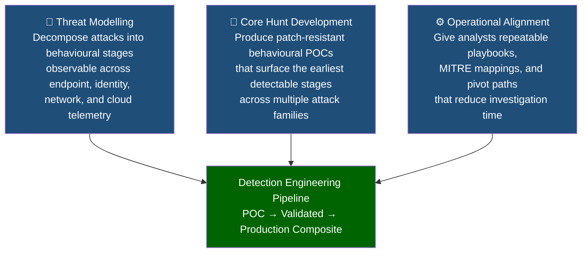

---

## The Problem This Repository Solves

### Why Signatures and IOCs Fail Modern Adversaries

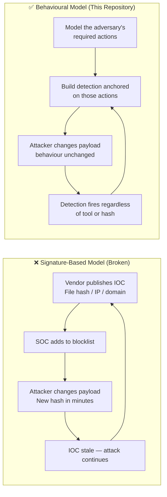

Modern sophisticated adversaries — ransomware crews, nation-state APTs, identity-first
intruders — operate on a simple operational principle: **rotate the tool, preserve the
tradecraft**. New payload, same behaviour. New infrastructure, same technique.

A detection anchored on a file hash dies the moment the attacker recompiles. A detection
anchored on the **sequence of actions an attacker must perform** never becomes stale.

This is the philosophical foundation of every model in this repository.

### Attack Categories That Cannot Be Solved With Signatures

| Attack Category | Why Signatures Fail | Behavioural Anchor |
|----------------|--------------------|--------------------|
| Ransomware ecosystems | New encryptor binary on every campaign | Backup deletion → mass file rename sequence |
| Identity intrusions | No malware — uses legitimate credentials | Anomalous logon path + admin tool deployment |
| Steganographic loaders | Payload inside signed image file | Browser parent → image load → script spawn chain |
| LOLBIN post-exploitation | Uses Windows-signed binaries | Signed binary + anomalous argument + network callback |
| BYOVD driver chains | Byte-flipped driver — unique hash every time | Sideload → driver stage → service → kernel load |
| MFA fatigue / coercion | No technical exploit | Authentication anomaly + MFA response pattern |
| Token abuse | Legitimate OAuth tokens — no malware | Token scope anomaly + lateral cloud movement |

---

## Methodology

### Four Principles

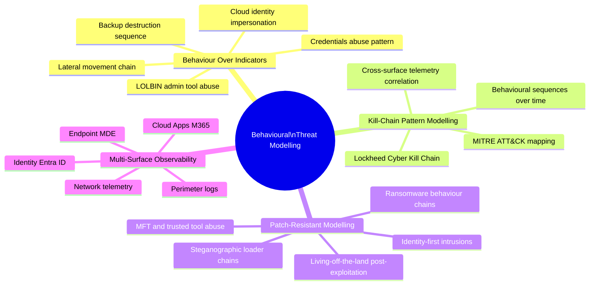

### Principle 1 — Behaviour Over Indicators

Threat actors routinely change payloads, hosting providers, infrastructure, and loaders.
What they **cannot easily change** are their behaviours:

- Credential access patterns (LSASS, DCSync, Kerberoasting)
- Lateral movement sequences (SMB → WMI → WinRM fallback chains)
- Pre-ransomware preparation (shadow deletion, backup destruction, recovery disable)
- Abuse of legitimate administrative tools (PsExec, RMMs, WMI, RDP)
- Cloud and identity impersonation sequences (token abuse, OAuth consent, MFA coercion)

Every model in this repository is anchored on these **immutable behavioural constants**.

### Principle 2 — Kill-Chain Pattern Modelling

Every attack, regardless of tooling, follows a detectable pattern:

```
A valid account misused outside normal hours
  → A host enumerating AD shortly after a new login
  → Admin tools deployed to multiple hosts in a short window
  → Backup deletion executed
  → Mass file rename begins
```

This is a **behavioural kill chain** — detectable at multiple points, regardless of which
specific tools the attacker used for each stage. We map these patterns using MITRE ATT&CK,
the Lockheed Cyber Kill Chain, and cross-surface telemetry correlation.

### Principle 3 — Patch-Resistant Threat Modelling

Some attack ecosystems are structurally resistant to patching:

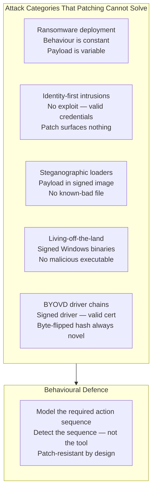

### Principle 4 — Multi-Surface Observability

High-value detection emerges from **cross-joining telemetry surfaces** — not from looking
at any single table in isolation.

| Surface | Primary Value | Key Telemetry |
|---------|--------------|---------------|
| **Endpoint (MDE)** | Process chains, LOLBins, file events, LSASS access, encryption patterns | DeviceProcessEvents, DeviceFileEvents, DeviceRegistryEvents |
| **Identity (Entra ID)** | MFA reset, token abuse, valid credential anomalies, impossible travel | IdentityLogonEvents, IdentityQueryEvents, SigninLogs |
| **Network** | C2 beaconing, lateral movement, data staging, exfiltration | DeviceNetworkEvents, CommonSecurityLog |
| **Cloud Apps (M365)** | App impersonation, consent abuse, service principal creation | CloudAppEvents, OfficeActivity, AuditLogs |
| **Perimeter Logs** | Reverse proxy signals, webshell indicators, unusual POST patterns | Custom connector tables, WAF logs |

---

## The POC-to-Production Pipeline

This is the most important architectural concept in this repository.

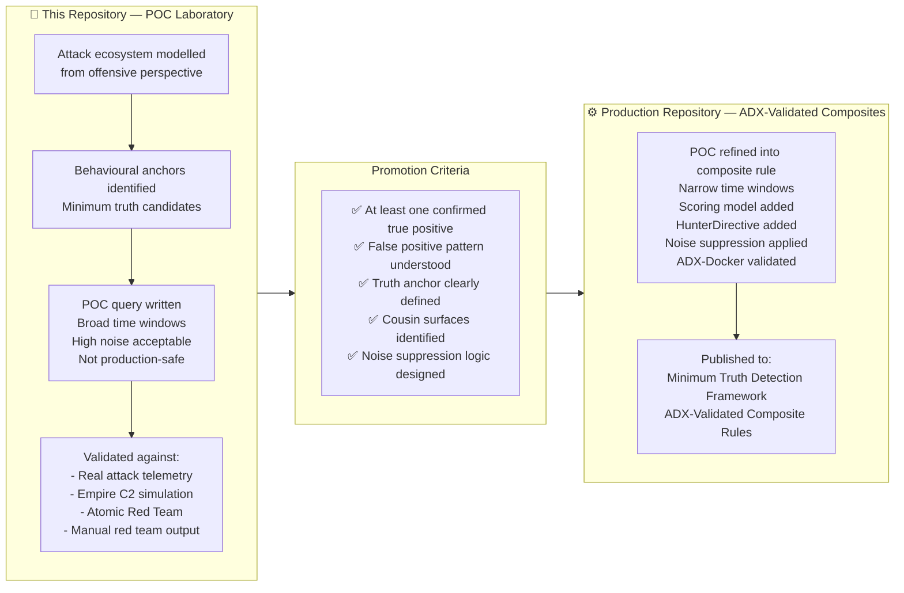

**Why this separation matters:**

A POC query and a production rule serve completely different purposes. A POC explores
whether a technique is detectable and what the telemetry looks like. A production rule
must fire at the right time with the right confidence and give an analyst an actionable
directive. Collapsing these two phases produces rules that are either too noisy to trust
or too narrow to catch real attacks. The pipeline keeps them separate with a formal
promotion gate between them.

---

## Threat Ecosystems Covered

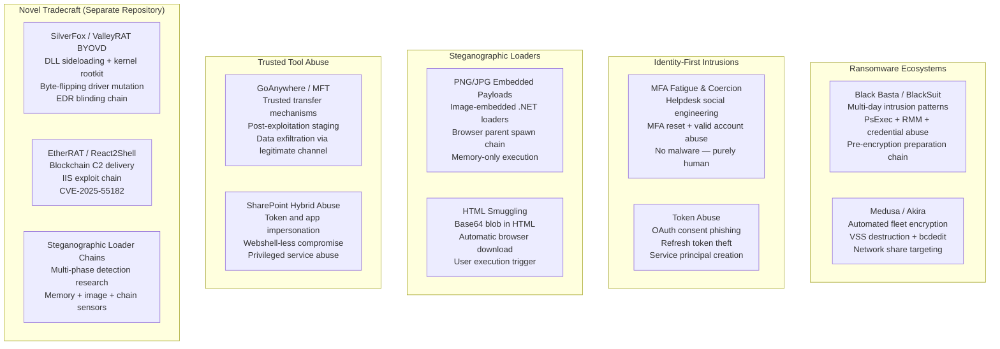

---

## Threat Modelling Framework — The SOP

### The Six-Step Model

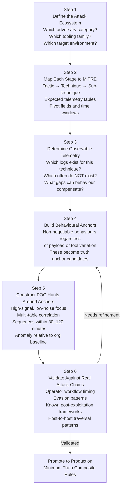

### Step 2 Detail — MITRE Mapping Template

Every ecosystem is mapped at the full depth of MITRE — not just technique labels but
the specific observable telemetry, pivot fields, and sequence context.

**Example: Black Basta Ecosystem Mapping**

| Stage | MITRE ID | Technique | Observable | Table | Pivot Field |
|-------|----------|-----------|------------|-------|-------------|
| Initial Access | T1566.001 | Spear-phishing attachment | Office macro spawning wscript | DeviceProcessEvents | InitiatingProcessFileName |
| Credential Access | T1003.001 | LSASS MiniDump | comsvcs.dll + MiniDump in CL | DeviceProcessEvents | ProcessCommandLine |
| Lateral Movement | T1021.002 | SMB PsExec | services.exe spawning cmd/ps | DeviceProcessEvents | InitiatingProcessFileName |
| Lateral Movement | T1219 | AnyDesk / ScreenConnect | Known RMM binary from user path | DeviceProcessEvents | FolderPath |
| Defense Evasion | T1562.001 | Shadow copy deletion | vssadmin delete + bcdedit /set | DeviceProcessEvents | FileName |
| Impact | T1486 | Data encryption | Mass file rename with new extension | DeviceFileEvents | FileName |

### Step 4 Detail — Behavioural Anchor Examples

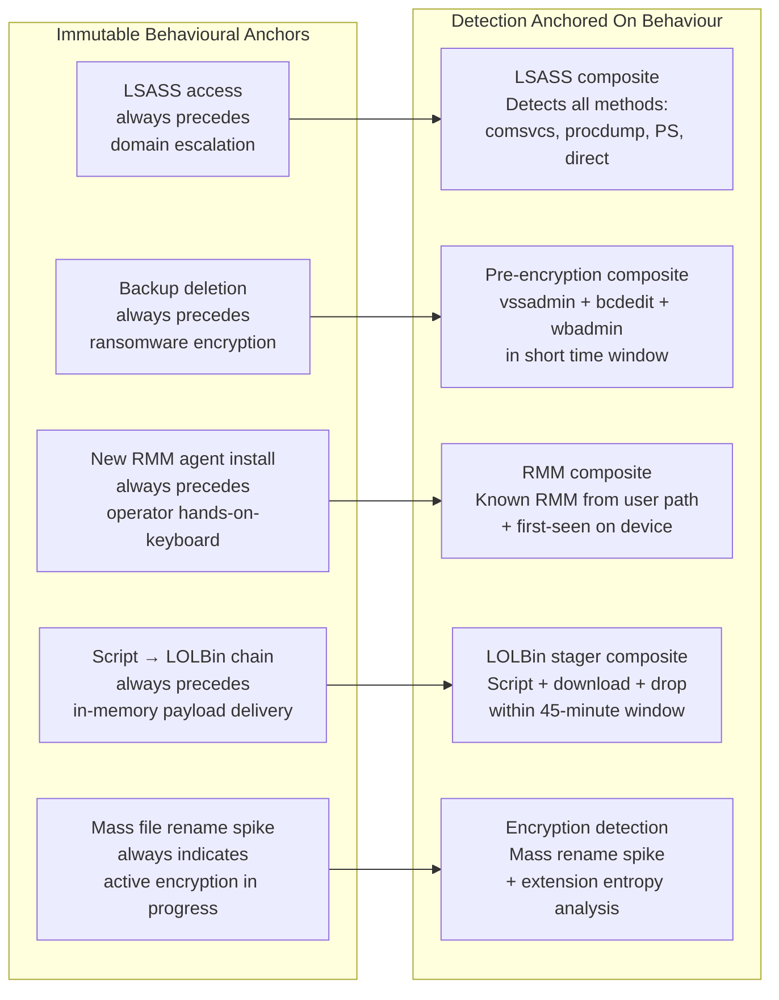

---

## Multi-Surface Observability Model

The most sophisticated detections emerge from correlating observables across multiple
telemetry surfaces simultaneously. A signal that is noise on one surface becomes a
high-confidence indicator when correlated with a signal from another.

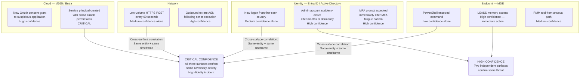

### Cross-Surface Correlation Examples

| Endpoint Signal | Identity Signal | Combined Confidence | Likely Scenario |
|----------------|-----------------|--------------------|--------------------|
| PowerShell encoded command | First-seen country logon same account | CRITICAL | Compromised account post-initial access |
| LSASS memory dump | Dormant admin account suddenly active | CRITICAL | Credential harvesting in progress |
| RMM tool deployed | MFA fatigue pattern on same account | CRITICAL | Black Basta-style hands-on-keyboard operator |
| Mass file rename spike | No identity anomaly | HIGH | Automated encryption — no hands-on operator |
| certutil download | New OAuth consent grant | HIGH | Payload delivery + persistence via app registration |

---

## Repository Structure

```plaintext
THREAT-MODELLING-SOP/
│
├── README.md                          ← This document
│
├── /Core-Hunts/                       ← POC hunt queries (not production)
│   ├── BlackBasta_Core.md             ← Ransomware behavioural chain POC
│   ├── Identity-Abuse_Core.md         ← MFA coercion + token abuse POC
│   ├── StegoLoader_Core.md            ← Steganographic loader chain POC
│   ├── GoAnywhere_Core.md             ← MFT trusted tool abuse POC
│   └── SharePoint_Core.md             ← Token + app impersonation POC
│
├── /Attack-Models/                    ← Offensive perspective breakdowns
│   ├── BlackBasta_AttackChain.md      ← Full Black Basta kill chain analysis
│   ├── IdentityAbuse_AttackChain.md   ← Identity-first intrusion model
│   ├── StegoLoader_AttackChain.md     ← Steganographic loader offensive model
│   ├── GoAnywhere_AttackChain.md      ← MFT post-exploitation model
│   └── SharePoint_AttackChain.md      ← SharePoint hybrid abuse model
│
├── /MITRE-Mapping/                    ← ATT&CK mapping tables
│   └── MITRE_MasterTable.md           ← Full cross-ecosystem MITRE index
│
└── /Promoted-To-Production/           ← Index of rules promoted to composite pack
    └── PROMOTION_LOG.md               ← POC → Production lineage record
```

---

## Outputs

This repository will produce the following artefacts across all threat ecosystems:

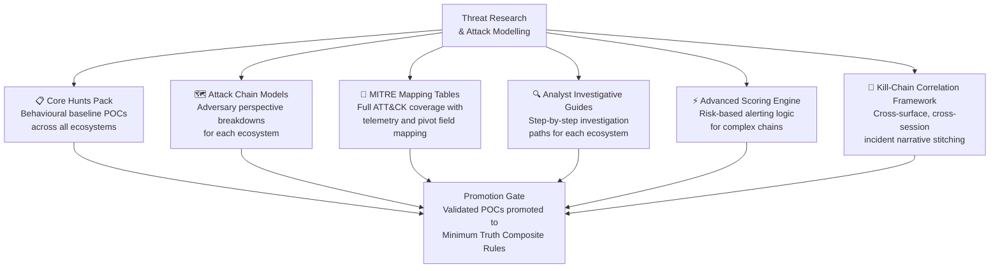

---

## Target Audience

```
👥 Senior SOC Analysts        — Threat context and hunt queries
🔍 Incident Responders        — Attack chain models and IR pivots
🎯 Threat Hunters             — Hypothesis-driven POC hunt library
⚙️  Detection Engineers       — POC-to-production promotion pipeline
🔴 Red Teamers (Blue Focus)   — Defensive insight into their own techniques
```

---

## Roadmap

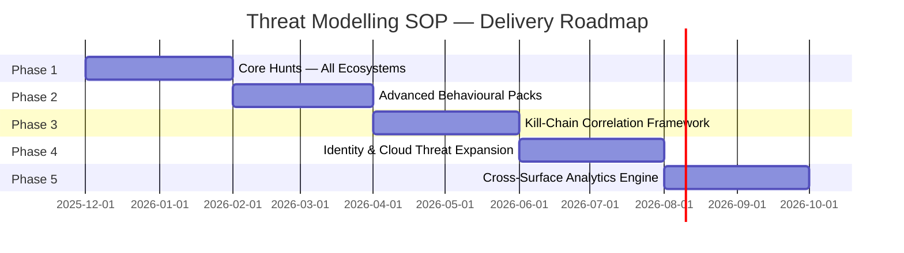

| Phase | Deliverable | Status |
|-------|-------------|--------|
| Phase 1 | Core Hunts for all behavioural ecosystems | 🟡 In Progress |
| Phase 2 | Advanced behavioural packs (scoring, chained sequences) | 🔴 Planned |
| Phase 3 | Full kill-chain correlation framework | 🔴 Planned |
| Phase 4 | Identity & cloud threat expansion (OAuth, token abuse) | 🔴 Planned |
| Phase 5 | Cross-surface analytics (endpoint + identity + cloud) | 🔴 Planned |

---

> [!NOTE]
> All content in this repository represents original threat research and proof-of-concept
> detection logic. Nothing here should be deployed directly to a production environment
> without ADX-Docker validation, noise profiling, and promotion through the pipeline
> documented above.

> [!TIP]
> **For production-ready detection rules**, visit the
> **[Minimum Truth Detection Framework — ADX-Validated Composite Rules](https://github.com/azdabat/Minimum-Truth-Detection-Framework-ADX-Validated-Composite-Rules)**
> repository where all promoted rules live.

---

*Author: Ala Dabat | [github.com/azdabat](https://github.com/azdabat)*  
*Licensed under [CC BY-NC-SA 4.0](https://creativecommons.org/licenses/by-nc-sa/4.0/legalcode)*
